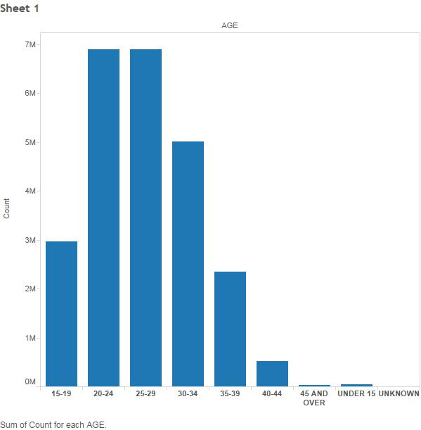
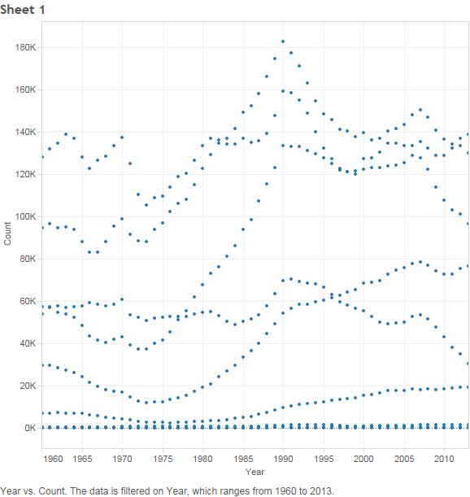
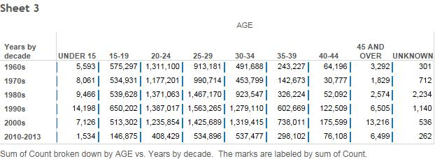

```{r echo=FALSE, message=FALSE}
setwd("C:/Users/Brian Yeh/Github/DataVisualization/DV_TProject1")
require("jsonlite")
require("RCurl")
require(extrafont)

require("ggplot2")

```
#Dataset
###Counts of births by Age of Mother

##Barchart
###Age vs Count for all years (1960-2013)


##ScatterPlot
###Year vs Count for all age groups


##CrossTab
###Year vs Age


