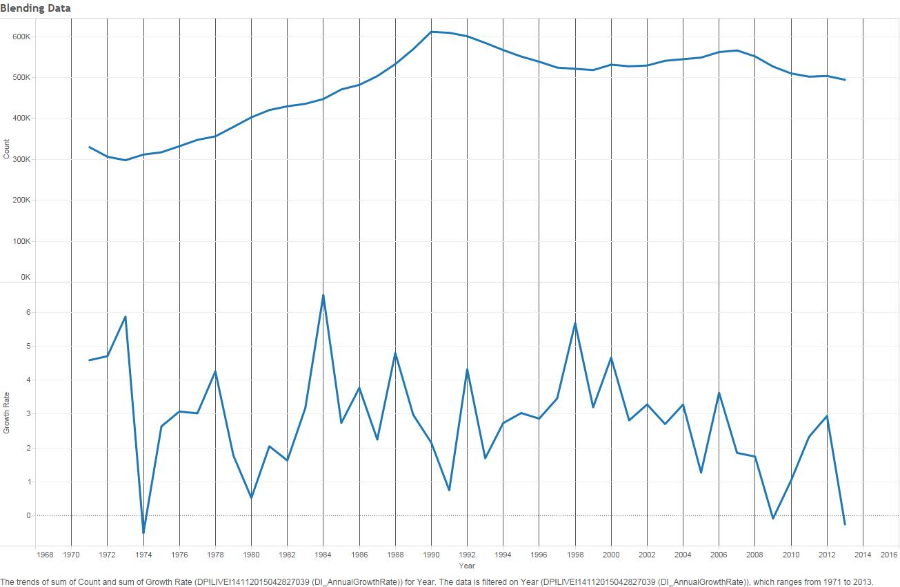

```{r echo=FALSE, message=FALSE}
#setwd("C:/Users/Brian Yeh/Github/DataVisualization/DV_TProject1")
require("jsonlite")
require("RCurl")
require(extrafont)

require("ggplot2")

```
#Dataset
###Counts of births by Age of Mother
```{r echo=FALSE}
source("../01 Data/Dataframes_Births.R", echo = TRUE)
summary(df)
```

##Barchart
###Age vs Count for all years (1960-2013)
```{r}
source("../01 Data/Dataframes_BarChart.R", echo = TRUE)
ggplot() + 
  coord_cartesian() + 
  scale_x_discrete() +
  scale_y_continuous(breaks=seq(0,7000000,1000000)) +
  labs(title='Births Cumulative - By Age') +
  labs(x=paste("AGE"), y=paste("COUNT")) +
  layer(data=df1, 
        mapping=aes(x=AGE, y=COUNT), 
        stat = "identity",
        stat_params=list(), 
        geom="bar",
        geom_params=list(),
        position=position_identity()
  )
```


##ScatterPlot
###Year vs Count for all age groups
```{r}
source("../01 Data/Dataframes_ScatterPlot.R", echo = TRUE)
ggplot() + 
  coord_cartesian() + 
  scale_x_continuous() +
  scale_y_continuous() +
  labs(x="YEAR", y=paste("COUNT")) +
  layer(data=df, 
        mapping=aes(x=as.numeric(as.character(YEAR)), y=COUNT, color=AGE), 
        stat_params=list(), 
        geom="point",
        geom_params=list(), 
        #position=position_identity()
        position=position_jitter(width=0.3, height=0)
  )
```


##CrossTab
###Year vs Age
```{r}
source("../01 Data/Dataframes_CrossTabs.R", echo = TRUE)
ggplot() + 
  coord_cartesian() +
  scale_x_discrete() +
  scale_y_discrete() +
  labs(x=paste("AGE"), y=paste("DECADE")) +
  layer(data=df, 
        mapping=aes(x=AGE, y=DECADE, label=COUNT), 
        stat="identity", 
        stat_params=list(), 
        geom="text",
        geom_params=list(colour="black", size = 3), 
        position=position_identity()
  ) +
  theme(axis.text.x = element_text(angle = 90, hjust = 1)
  ) +
  layer(data=df, 
        mapping=aes(x=AGE, y=DECADE, fill=DECADE), 
        stat="identity", 
        stat_params=list(), 
        geom="tile",
        geom_params=list(alpha=0.50), 
        position=position_identity()
  )
```


##Blending Data
###Count of Babies born vs Growth rate of Disposible Income (Joined on Year)


